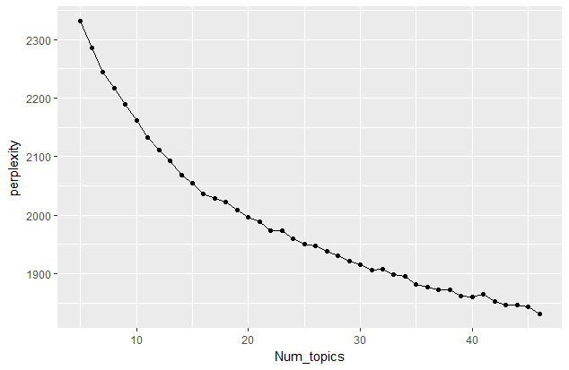

```{r setup, include=FALSE}
knitr::opts_chunk$set(echo = TRUE)
```

#数据获取

网站[传送门](http://chuansong.me/)
转载了各大微信公众号的历史文章。我们从该网站上随机抽取三个关注人数较多的娱乐八卦公众号，抓取2016年4月中旬至2017年2月中旬的所有历史文章，及其阅读数与点赞数等信息，共计1953条记录作为我们的语料库。

#理论

##LDA模型

潜在狄利克雷分布（Latent Dirichlet allocation,LDA）主题模型，是文本挖掘中著名的生成概率模型。它由David M. Blei、Andrew Y. Ng、Michael I. Jordan在2013年提出。


###记号：

1. 一个词语是该离散数据中最基本的单位，词典中所有词语由 ${1,2,...,V}$ 索引。每个词语可由一个单位基向量表示，即词典中的第 $v$ 个词表示为 $V$ 维向量 $w$ ，其中 $w^v=1\quad w^u=0,u\neq v$ ;

2. 一篇具有 $N$ 个词的文档记为词序列 $\vec w_n=(w_1,w_2,...,w_N)$ ，其中 $w_n$ 是序列中的第n个词语；

3. $M$ 篇文档组成的语料库记为 $D=\{{\vec w}_1,{\vec w}_2,...,{\vec w}_M\}$ 。


##DGP:

LDA是一个层次贝叶斯模型，它的基本思想是：一篇文章可能具有多个主题，而文档的主题分布服从一个潜在的狄利克雷分布，而每一个主题代表一种词语分布，即一篇文档的生成服从以下步骤：

1. 选择 $N \sim Poission(\xi)$ ;
2. 选择 $\theta\sim Dir(\alpha)$ ;
3. 对于N个词中的每一个词语 $w_n$ :
 + 选择其来自于哪一个主题 $z_n\sim Multinomial(\theta)$ ；
 + 从多项式条件分布 $p(w_n|z_n,\beta)$ 中生成一个词语w_n。
 
其中假设主题数k（狄利克雷分布的维度）是已知且固定的；给定主题，词语的条件分布kxV维矩阵 $\beta \qquad where \quad\beta_{ij}=p(w^j=1|z^i=1)$ 是未知非随机矩阵。文档长度N服从泊松分布，且与过程1.、2.独立。
 
结构可表述如下图????


需注意与简单狄利克雷-多项式分布聚类模型不同，LDA模型允许一个文档具有多个主题。

具有图[LDA结构图]所示结构的模型在贝叶斯方法中被称为层次模型（Gelman et al., 1995），或条件独立层次模型（conditionally independent hierarchical model, Kass and Steffey, 1989）。LDA参数 $\alpha,\beta$可以由经验贝叶斯方法进行估计。

##推断与参数估计

LDA模型最终的目的是，给定文档，推断其潜在主题的后验分布：
$$p(\theta,\vec z|\vec w,\alpha,\beta)=\frac{p(\theta,\vec z,\vec w|\alpha,\beta)}{p(\vec w|\alpha,\beta)}$$
具体过程可以采用拉普拉斯逼近、变分近似法、MCMC方法计算。本文中我们采用MCMC方法，利用gibbs抽样近似计算后验分布。


#LDA提取文档主题

##分词处理和词典构建

初步形成语料库之后，需要对语料进行分词处理和词典构建。

我们首先进行预分词处理，随机抽取10%的文档分词结果，筛选关键词语作为用户词典；从网上抓取明星名库，与中文停止词典合并作为新的停止词。如此，在最终分词中我们筛去了无意义的语气词和明星姓名，选取复现频率大于50的词语组成字典。

##主题数k的确定

由于主题数k未确定，我们将k作为超参数，计算k从5~45共40个模型的五折交叉验证困惑度，这里的困惑度（perplexity）是LDA模型的误差指标，用来衡量模型在预测测试集样本的效果。



理想情况下主题数应选取使困惑度最小化的k或明显的拐点。但这里呈现较平滑的凸曲线，故此考虑选取 $k=20$ ，$k\leq 20$ 时困惑度下降较快，随后平缓。

##LDA模型其它参数选择

模型初始参数 $\alpha$ 影响主题的集中度，$\alpha$ 越大最终所有文档倾向于集中在某几个主题；$\beta$ 则影响词语的集中度，体现在 $\beta$ 越大，每个主题更集中在几个词汇上面，或者而每个词汇都尽可能的百分百概率转移到一个主题上。

我们选取 $\alpha=0.1,\beta=0.1$ 这是较为常用的选择。

最终提取出的主题与主题关键词如下：

（放思婷那张表）